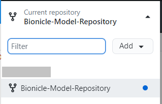
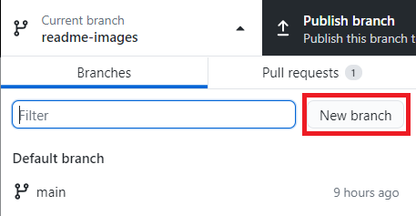
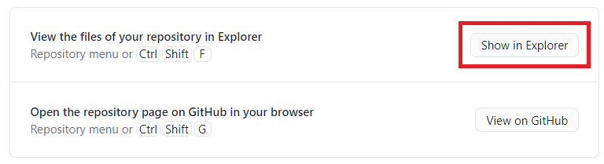
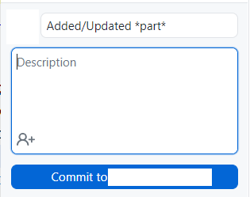
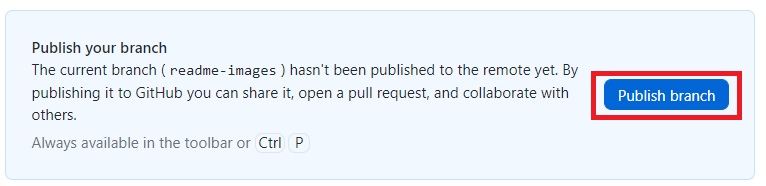
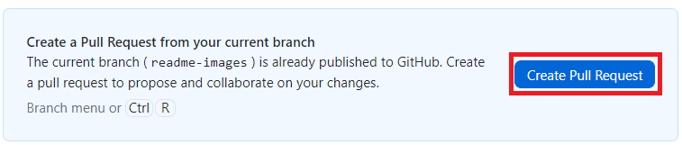

Shield: [![CC BY-SA 4.0][cc-by-sa-shield]][cc-by-sa]

This work is licensed under a
[Creative Commons Attribution-ShareAlike 4.0 International License][cc-by-sa].

[![CC BY-SA 4.0][cc-by-sa-image]][cc-by-sa]

[cc-by-sa]: http://creativecommons.org/licenses/by-sa/4.0/
[cc-by-sa-image]: https://licensebuttons.net/l/by-sa/4.0/88x31.png
[cc-by-sa-shield]: https://img.shields.io/badge/License-CC%20BY--SA%204.0-lightgrey.svg

## About

This is Bionicle Part Model repository. This repository is created and supported by Discord server Bionicle 3d modeling.
[Join us](https://discord.gg/XS7yjdg "Join us")

## Rules

You can add and update parts through pull request. Your pull request must constains pictures of:
- models from different views if you add new parts;
- comparison of old and new models if you update parts;

Parts must be named as follows "NUMBER - Part name on BrickLink.

## Guide

If you haven't used GitHub befor there is simple instruction:

1. Create GitHub account;

2. Fork this repository;

3. Download [GitHub Desktop](https://desktop.github.com/ "GitHub Desktop") and sign in;

4. Open forked repository;

5. Create new branch;

6. Open folder in file explorer;

7. Add or update models;

8. Commit changes;

9. Publish branch;

10. Create pull request;

