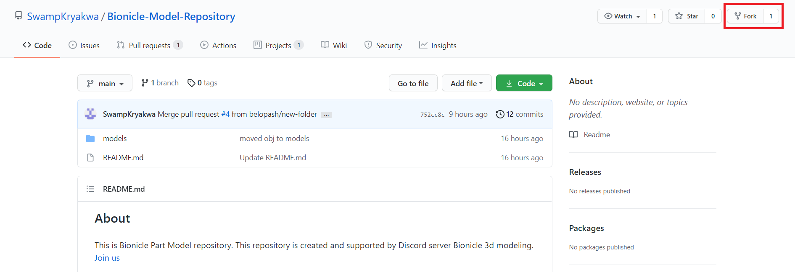
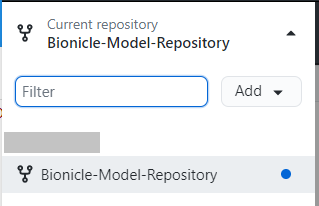
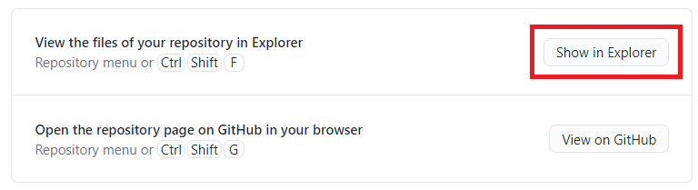
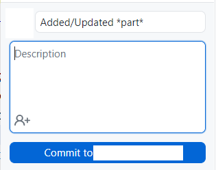
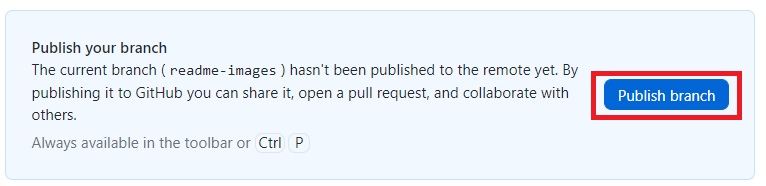
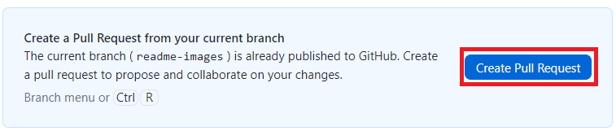

## About

This is Bionicle Part Model repository. This repository is created and supported by Discord server Bionicle 3d modeling.
[Join us](https://discord.gg/XS7yjdg "Join us")

## Rules

You can add and update parts through pull request. Your pull request must constains pictures of:
- models from different views if you add new parts;
- comparison of old and new models if you update parts;

Parts must be named as follows "NUMBER - Part name on BrickLink.

## Guide

If you haven't used GitHub befor there is simple instruction:
1. Create GitHub account;

2. Fork this repository;

3. Download [GitHub Desktop](https://desktop.github.com/ "GitHub Desktop") and sign in;

4. Open forked repository;

4. Create new branch;

5. Open folder in file explorer;

6. Add or update models;

7. Commit changes;

8. Publish branch;

8. Create pull request;

